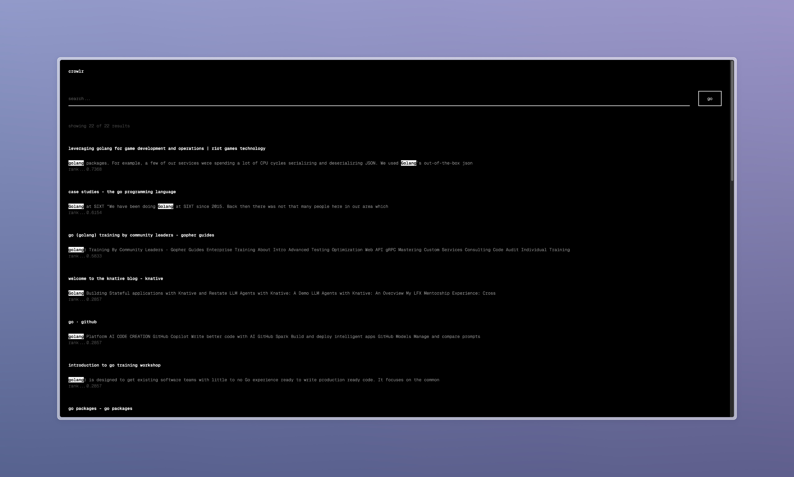
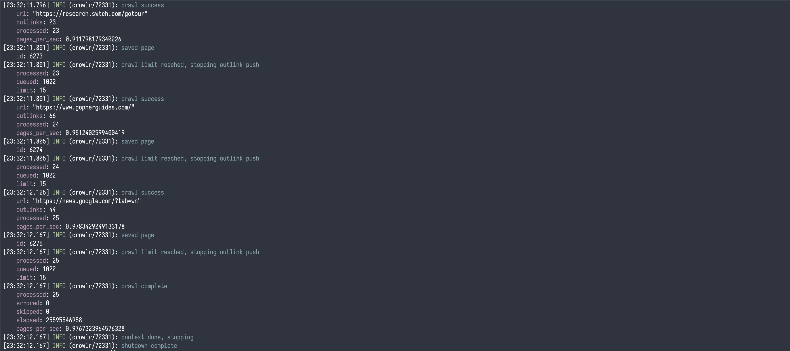
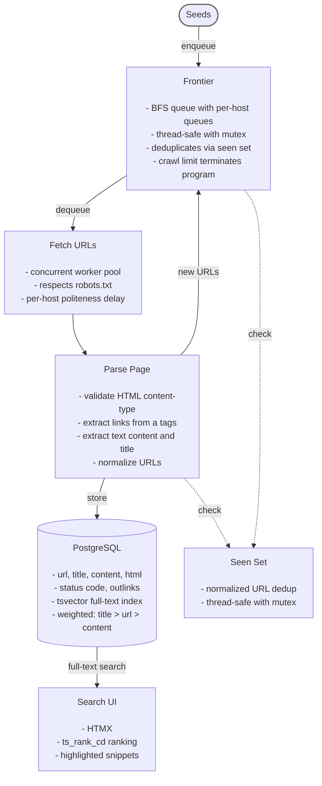

# crowlr

web crawler with full-text search, built in golang.

## Overview

A web crawler is a program that systematically browses the web. It starts with a list of seed URLs, visits each one, extracts the hyperlinks from the page, and adds them to a queue called the crawl frontier. It then visits the next URL from the queue and repeats the process, gradually discovering and indexing web pages.

crowlr follows this model: it crawls pages concurrently using a worker pool, respects robots.txt and per-host politeness delays, stores page content in PostgreSQL, and makes it searchable through a built-in full-text search UI.

## Screenshots

### Search Interface



### Crawler Output



## Architecture



## Features

- Concurrent crawling with configurable worker pool
- Respects robots.txt
- Per-host politeness delays
- URL normalization (scheme, host casing, default ports, fragments, dot segments)
- PostgreSQL storage with full-text search (weighted tsvector: title > url > content)
- Minimal search UI with HTMX

## Requirements

- Go 1.21+
- PostgreSQL 14+ (or Docker)

## Setup

```bash
# Clone
git clone https://github.com/devraulu/crowlr.git
cd crowlr

# Start PostgreSQL
docker compose up -d

# Configure
cp config.example.toml config.toml
cp seeds.example.txt seeds.txt
# Add seed URLs to seeds.txt

# Run crawler
make dev

# Run search UI (separate terminal)
make web
# Open http://localhost:8080
```

## Configuration

See `config.example.toml` for all options.

| Option | Description | Default |
|--------|-------------|---------|
| `dsn` | PostgreSQL connection string | - |
| `crawler.workers` | Number of concurrent workers | `8` |
| `crawler.crawl_limit` | Max pages to crawl | `1000` |
| `crawler.user_agent` | User-Agent header | - |
| `politeness.delay` | Min delay between requests to same host | `1s` |
| `logging.level` | Log level (debug, info, warn, error) | `info` |
| `logging.format` | Log format (text, json) | `json` |

## Project Structure

```
cmd/
  crawler/    # crawler binary
  web/        # search UI binary
pkg/
  crawler/    # coordinator, workers, stats
  process/    # HTML parsing, text extraction, normalization, robots.txt
  storage/    # PostgreSQL with migrations and full-text search
  config/     # TOML configuration
  logger/     # structured logging (bunyan-compatible)
```

## License

MIT
