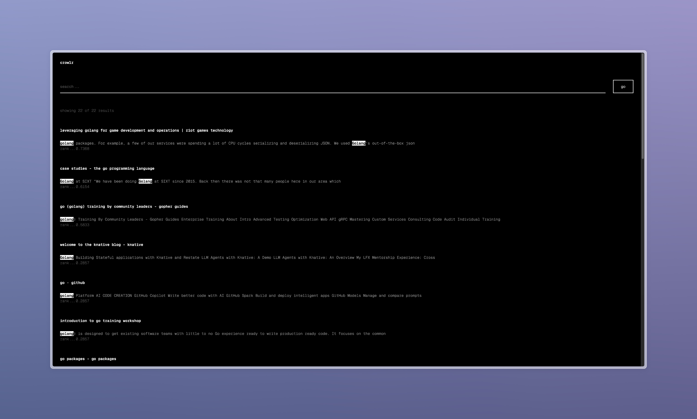
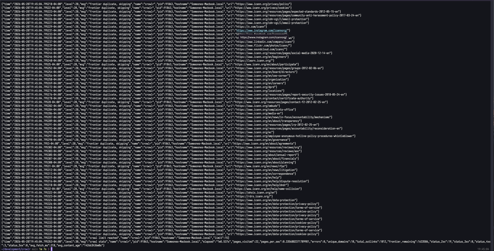
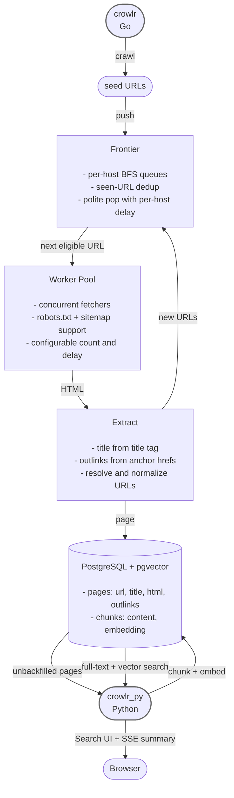

# crowlr

web crawler with full-text search and RAG-powered Q&A. Crawling is built in Go for performance; the search UI, backfill (chunking/embedding), and LLM calling live in Python (`python/`).

## Overview

A web crawler is a tool designed to explore the internet automatically. Beginning with a set of starting web addresses, it visits each site, collects links found on those pages, and adds them to a queue for future visits. This cycle continues, allowing the crawler to find and catalog new websites over time.

crowlr works in a similar way: it visits multiple pages at once using a pool of workers, pays attention to robots.txt rules and waits between requests to avoid overloading sites, and saves page data in PostgreSQL. A separate Python service backfills embeddings for crawled pages and serves a full-text search UI plus a streamed, LLM-generated summary of the top matches.

## Screenshots

### Search Interface



### Crawler Output



## Architecture


```mermaid
flowchart TB
    Binary([crowlr<br/>Go]):::binary

    Binary -->|crawl| Seeds

    Seeds([seed URLs]) -->|push| Frontier

    Frontier[Frontier<br/><br/>- per-host BFS queues<br/>- seen-URL dedup<br/>- polite pop with per-host delay]

    Frontier -->|next eligible URL| Workers

    Workers[Worker Pool<br/><br/>- concurrent fetchers<br/>- robots.txt + sitemap support<br/>- configurable count and delay]

    Workers -->|HTML| Extract

    Extract[Extract<br/><br/>- title from title tag<br/>- outlinks from anchor hrefs<br/>- resolve and normalize URLs]

    Extract -->|new URLs| Frontier
    Extract -->|page| DB

    DB[(PostgreSQL + pgvector<br/><br/>- pages: url, title, html, outlinks<br/>- chunks: content, embedding)]

    Py([crowlr_py<br/>Python]):::binary

    DB -->|unbackfilled pages| Py
    Py -->|chunk + embed| DB
    DB -->|full-text + vector search| Py
    Py -->|Search UI + SSE summary| Browser([Browser])

    classDef binary stroke:#666,stroke-width:2px
```

## Features

- Concurrent crawling with configurable worker pool
- Respects robots.txt
- Per-host politeness delays
- URL normalization (scheme, host casing, default ports, fragments, dot segments)
- PostgreSQL storage with full-text search (weighted tsvector: title > url > content)
- Backfill: chunks + embeds crawled pages into pgvector (Python)
- Minimal search UI with HTMX, plus a streamed LLM summary of top results (Python)

## Requirements

- Go 1.21+
- Python 3.11+ with [uv](https://docs.astral.sh/uv/)
- PostgreSQL 14+ with pgvector (or Docker)
- A locally running [Ollama](https://ollama.com) with `nomic-embed-text` and `llama3.2:3b` pulled (default LLM provider; see `python/README.md`)

## Setup

```bash
# Clone
git clone https://github.com/devraulu/crowlr.git
cd crowlr

# Start PostgreSQL
docker compose up -d

# Configure
cp config.example.toml config.toml
cp seeds.example.txt seeds.txt
# Add seed URLs to seeds.txt

# Crawl (Go)
make crawl

# Backfill embeddings, then run the search/Q&A UI (Python)
make py-install
make py-backfill
make py-web
# Open http://localhost:8080
```

## Configuration

`config.toml` is shared by the Go crawler and the Python service — see `config.example.toml` for all options.

| Option | Description | Default | Used by |
|--------|-------------|---------|---------|
| `dsn` | PostgreSQL connection string | - | Go, Python |
| `crawler.workers` | Number of concurrent workers | `8` | Go |
| `crawler.crawl_limit` | Max pages to crawl | `1000` | Go |
| `crawler.user_agent` | User-Agent header | - | Go |
| `politeness.delay` | Min delay between requests to same host | `1s` | Go |
| `politeness.fetch_timeout` | Max duration for an individual fetch | `10s` | Go |
| `logging.level` | Log level (debug, info, warn, error) | `info` | Go, Python |
| `logging.format` | Log format (text, json) | `json` | Go, Python |
| `llm.provider` | LLM provider (`ollama` for now) | `ollama` | Python |
| `llm.ollama_url` | Ollama base URL | `http://localhost:11434` | Python |
| `llm.embed_model` | Embedding model | `nomic-embed-text` | Python |
| `llm.gen_model` | Generation model | `llama3.2:3b` | Python |

## Project Structure

```
cmd/
  crawler/    # Go binary — `crawl` subcommand only
pkg/
  crawler/    # frontier, workers, postgres store, full-text search, DB migrations
  config/     # TOML configuration (crawler-relevant fields)
  logger/     # structured logging (bunyan-compatible)
python/
  crowlr_py/  # backfill script, LLM abstraction, web server (search UI + SSE summary)
```

## License

MIT
