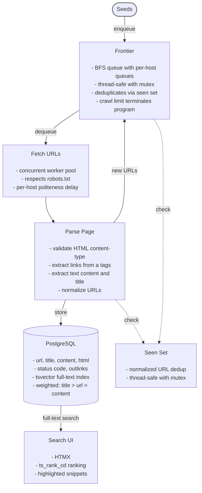

# crowlr

web crawler with full-text search, built in golang.

## Overview

A web crawler is a tool designed to explore the internet automatically. Beginning with a set of starting web addresses, it visits each site, collects links found on those pages, and adds them to a queue for future visits. This cycle continues, allowing the crawler to find and catalog new websites over time.

crowlr works in a similar way: it visits multiple pages at once using a pool of workers, pays attention to robots.txt rules and waits between requests to avoid overloading sites, saves page data in PostgreSQL, and lets users search everything through an integrated full-text search interface.

## Screenshots

### Search Interface


### Crawler Output


## Architecture


```mermaid
flowchart TB
    Start([Seeds]):::start -->|enqueue| Queue

    Queue[Frontier<br/><br/>- BFS queue with per-host queues<br/>- thread-safe with mutex<br/>- deduplicates via seen set<br/>- crawl limit terminates program]

    Queue -->|dequeue| Fetch

    Fetch[Fetch URLs<br/><br/>- concurrent worker pool<br/>- respects robots.txt<br/>- per-host politeness delay]

    Fetch --> Parse

    Parse[Parse Page<br/><br/>- validate HTML content-type<br/>- extract links from a tags<br/>- extract text content and title<br/>- normalize URLs]

    Parse -->|new URLs| Queue
    Parse -->|store| DB

    DB[(PostgreSQL<br/><br/>- url, title, content, html<br/>- status code, outlinks<br/>- tsvector full-text index<br/>- weighted: title > url > content)]

    DB -->|full-text search| Search

    Search[Search UI<br/><br/>- HTMX<br/>- ts_rank_cd ranking<br/>- highlighted snippets]

    Seen[Seen Set<br/><br/>- normalized URL dedup<br/>- thread-safe with mutex]

    Parse -.->|check| Seen
    Queue -.->|check| Seen

    classDef start stroke:#666,stroke-width:2px
```

## Features

- Concurrent crawling with configurable worker pool
- Respects robots.txt
- Per-host politeness delays
- URL normalization (scheme, host casing, default ports, fragments, dot segments)
- PostgreSQL storage with full-text search (weighted tsvector: title > url > content)
- Minimal search UI with HTMX

## Requirements

- Go 1.21+
- PostgreSQL 14+ (or Docker)

## Setup

```bash
# Clone
git clone https://github.com/devraulu/crowlr.git
cd crowlr

# Start PostgreSQL
docker compose up -d

# Configure
cp config.example.toml config.toml
cp seeds.example.txt seeds.txt
# Add seed URLs to seeds.txt

# Run crawler
make dev

# Run search UI (separate terminal)
make web
# Open http://localhost:8080
```

## Configuration

See `config.example.toml` for all options.

| Option | Description | Default |
|--------|-------------|---------|
| `dsn` | PostgreSQL connection string | - |
| `crawler.workers` | Number of concurrent workers | `8` |
| `crawler.crawl_limit` | Max pages to crawl | `1000` |
| `crawler.user_agent` | User-Agent header | - |
| `politeness.delay` | Min delay between requests to same host | `1s` |
| `logging.level` | Log level (debug, info, warn, error) | `info` |
| `logging.format` | Log format (text, json) | `json` |

## Project Structure

```
cmd/
  crawler/    # crawler binary
  web/        # search UI binary
pkg/
  crawler/    # coordinator, workers, stats
  process/    # HTML parsing, text extraction, normalization, robots.txt
  storage/    # PostgreSQL with migrations and full-text search
  config/     # TOML configuration
  logger/     # structured logging (bunyan-compatible)
```

## License

MIT
